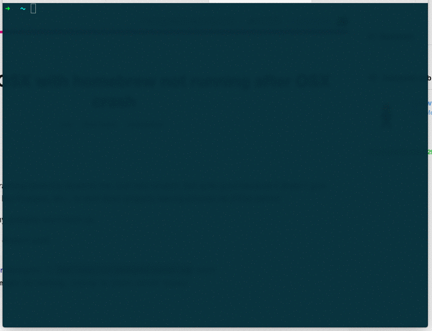
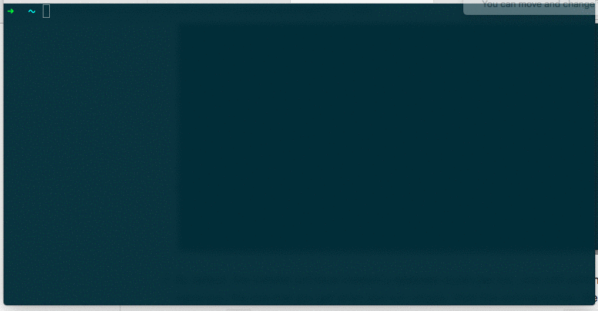
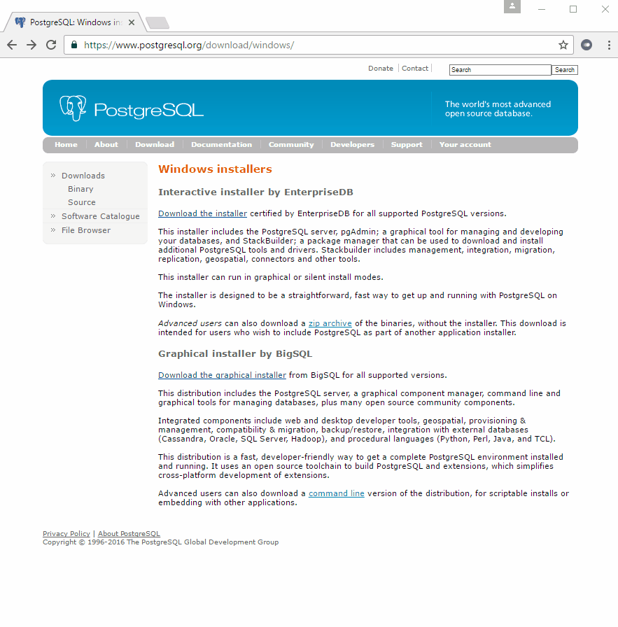
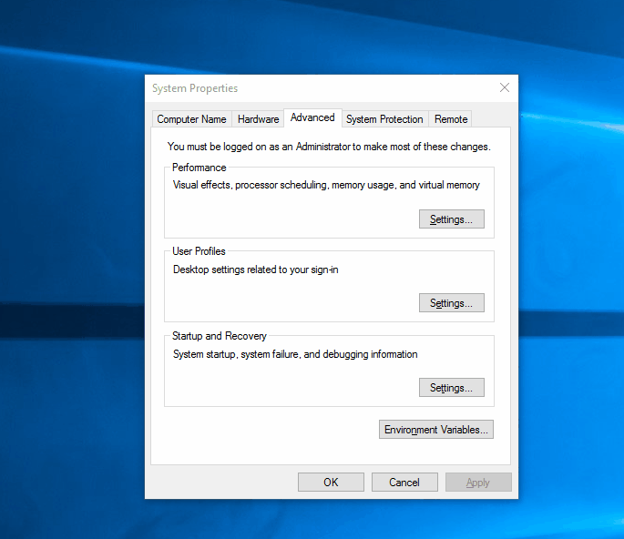
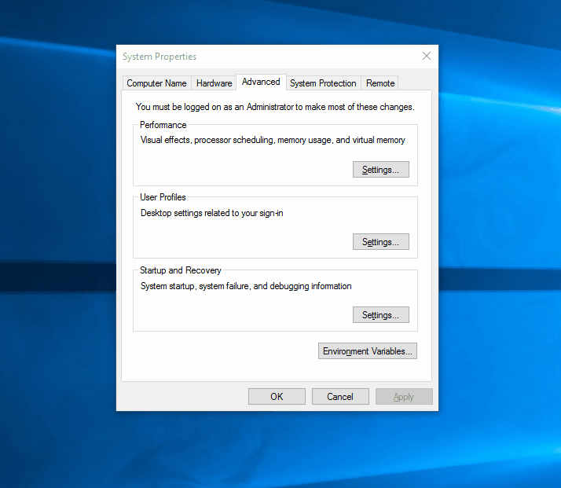
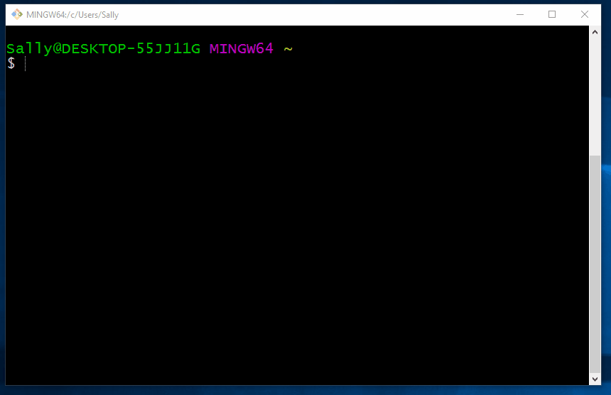
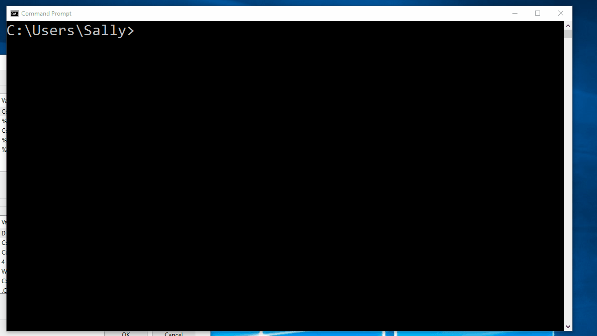

In this reading, we'll go through setting up Postgres locally.

Mac and Windows users will find separate instructions.

## Setting up Postgres on Mac

We'll use Homebrew to install Postgres.

1. Run `brew doctor` and if any issues appear, follow Brew's recommendation for fixing.
2. Run `brew update`.
3. Run `brew install postgres`. In addition to installing Postgres, this step will also create a folder at `/usr/local/var/postgres`, which is where the database files will be stored. If you get an error at this step, try running `initdb -D /usr/local/var/postgres` from the command line.
4. Next, we need to set an environment variable for [`PGDATA`](https://www.postgresql.org/docs/9.1/static/storage-file-layout.html). If you followed the [Mac dev environment setup instructions](/node-001v5/uuid/578e2970-80d6-11e6-bf54-4d60b9e16dfc) from earlier in this course, you should already have a `~/.bash_profile` file. We'll append our `PGDATA` environment variable to the bottom of this file. Run `echo "export PGDATA=/usr/local/var/postgres" >> ~/.bash_profile`.
5. Now, let's activate the new environment variable in the same terminal console by running `source ~/.bash_profile`.
6. To start the server, from the command line run `pg_ctl start -l $PGDATA/server.log`. You can also start the server with just `pg_ctl`, but then the server may log to the standard out in the current terminal window, which means you need to open a separate terminal window to do other operations, even though closing this one wouldn't stop the server.

  

7. By default, the installer will have created a database superuser (i.e., one with admin level privileges) with your system name (i.e., the one that you get when you run `whoami` from the command line). We're going to create a superuser with the name `dev` that we can use when developing locally. While the server is running, enter the command `createuser -Pw --interactive`. When prompted, enter `dev` for the name, a password of your choosing, and `y` for the superuser option. This will create a new admin level user named `dev`. When we connect to the database server through our Node apps, we'll have to supply our password, but we've set up this user so that when working with psql from the command line, we won't need to manually supply the password.

  

8. Next, we'll create a database called `dev`. Run the command `createdb -U dev dev`.
9. Now, let's try to use the *psql* shell. Run the command `psql -U dev` from the command line. This will connect you as the user "dev" to the database named "dev". When you start `psql` without listing a database to connect to, it attempts to connect to a db with the name of the user. We also could have done `psql -U dev dev` to be explicit about the database we're connecting to. We'll learn all about working with psql in the next reading, but for now try running the command `\l` to list the databases on the server. To get out of that screen, type `\q`, and then type `\q` to quit the psql shell.
10. To stop the database server, run `pg_ctl stop`.

## Windows instructions

1. Go to [this page](https://www.postgresql.org/download/windows/) and click "Download the installer" for EnterpriseDB. The one at the top of the page will be the most recent stable release, which is the one you should pick. From the installer options, select the most recent version (9.6.1 at time of writing) and Windows x86-64 for operating system.

  

2. When the download completes, find it in your download folder. It will be called something like postgreSQL-9.x.X-windows-x64. Double click on the file to start the installer.
3. Choose the default options when the installer runs, noting the folder that PostgreSQL installs to in the data folder. You'll be asked to provide a password for the `postgres` user, which is the default super user for Postgres. Be sure to make a note of the password you choose, as you'll need it later. It may take a minute or two for the installation to complete. When it does complete, you may be asked if you want to run StackBuilder to download and install additional tools. Choose no.
4. Next, we need to set some environment variables. The first one we'll set is for `POSTGRES_DIR` and it will point to the root folder of our Postgres install. From "System Properties", add a new environment variable for `POSTGRES_DIR` with the value `C:/Program Files/PostgreSQL/9.6` (assuming you installed Postgres to the default location, and that the stable version when you downloaded it was 9.6).

  

5. Now, we need to create a `PGDATA` environment variable, which points to the folder that database files are stored in. We can reuse the `POSTGRES_DIR` variable we just created. Reopen the System Properties => Environment Variables, and add a new entry for `PGDATA`, setting it to `%POSTGRES_DIR%\data`.

  

6. Finally, we need to edit the `PATH` variable so we can run Postgres commands like `psql` and `createdb` from the command line. Edit the existing `PATH` variable by appending `%POSTGRES_DIR%/bin`.

  

7. Close all GitBash windows, then open a new one.
8. To start the server, from the command line run `pg_ctl start -l "$PGDATA/server.log"`. You can also start the server with just `pg_ctl`, but then the server may log to the standard out in the current terminal window, which means you need to open a separate terminal window to do other operations, even though closing this one wouldn't stop the server.

  

9. Before we continue, let's set up our pgpass.conf file. This file tells the postgres client what password to use when attempting to connect to our local server as the `postgres` user. In GitBash, run the following commands, substituting 'password' with the password you chose during step 3:
```
mkdir $APPDATA/postgresql
echo "localhost:5432:*:postgres:password" > $APPDATA/postgresql/pgpass.conf
```

  

10. Now, we need to create a super user called "dev". In GitBash, run `createuser -U postgres -Pw --interactive`. When prompted, enter `dev` for the name, a password of your choosing and `y` for the superuser option. This will create a new admin level user named `dev`. When we connect to the database server through our Node apps, we'll have to supply our password, but we've set up this user so that when working with psql from the command line, we won't need to manually supply the password.

  

11. Next, we'll create a database called `dev`. In GitBash, run the command `createdb -U dev dev`.
12. Now, let's try to use the *psql* shell. In a GitBash terminal, run the command `psql -U dev` from the command line. This will connect you as the user "dev" (that's the `-U dev` part of the command) to the database named "dev". When you start `psql` without listing a database to connect to, it attempts to connect to a db with the name of the user. We also could have done `psql -U dev dev` to be explicit about the database we're connecting to. We'll learn all about working with psql in the next reading, but for now try running the command `\l` to list the databases on the server, and then `\q` to quit.
