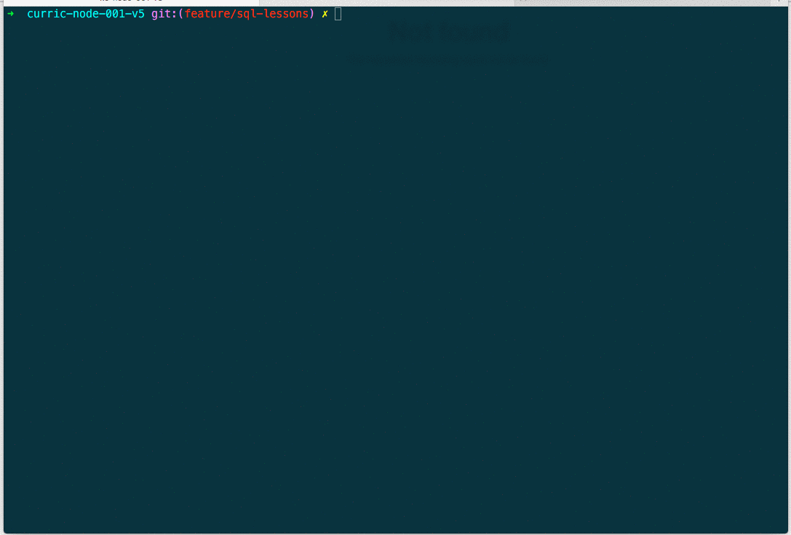
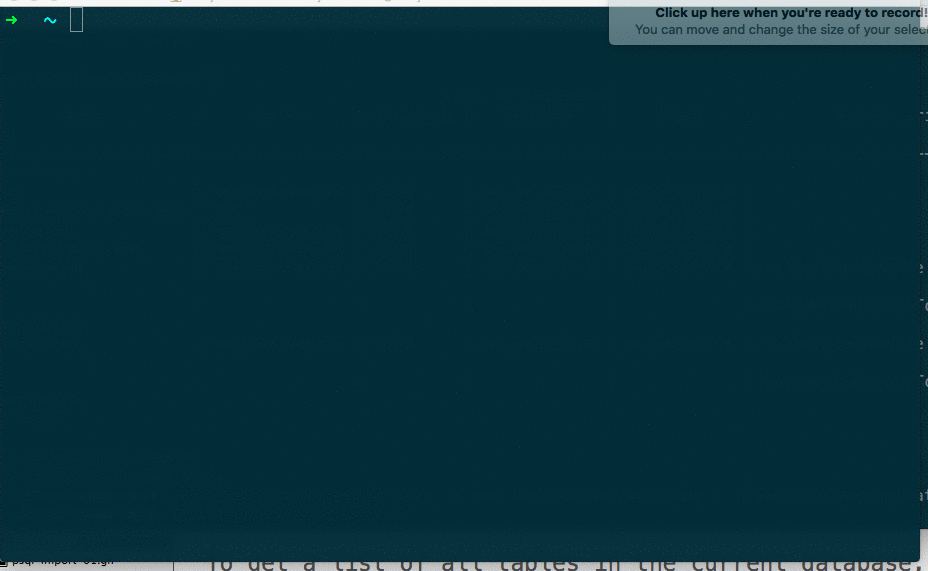
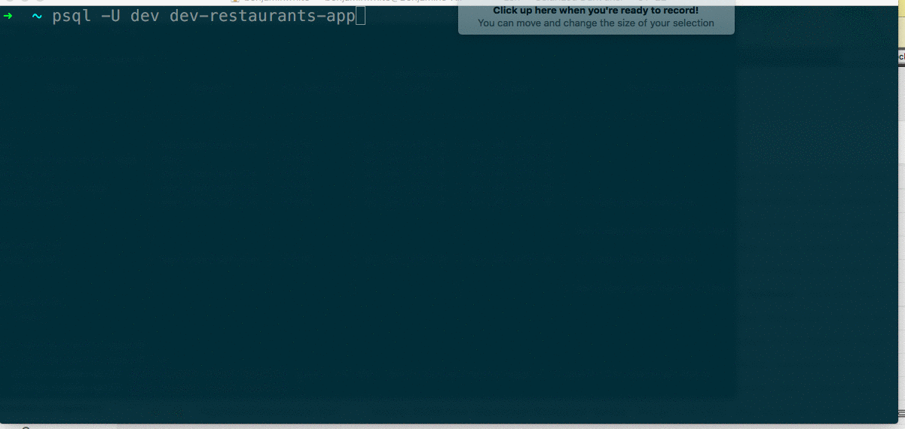
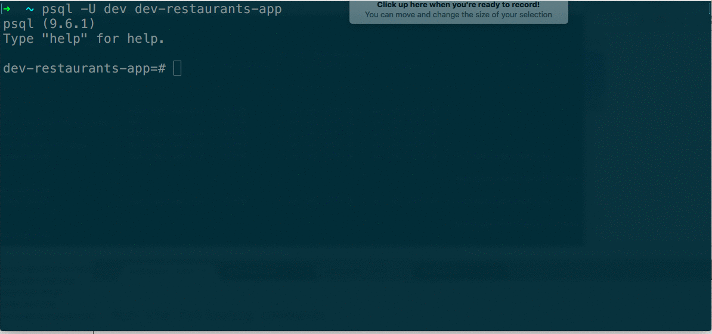
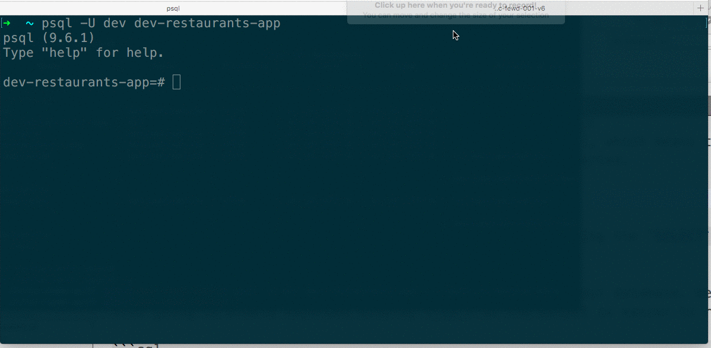

In this reading, we'll get you up to speed on the basics of working with SQL and Postgres. You'll learn how to create databases, import backup data, and perform CRUD operations. We'll revisit the New York City restaurants dataset, this time as a relational database.

Before moving on, make sure your Postgres server is running with `pg_ctl status` and start it if it's not (`pg_ctl start`).

###### This guide is meant to help you get your footing with SQL. After going through this lesson, if you feel like you want to explore SQL/Postgres in greater depth the following resources are high quality: [the official Postgres tutorial](https://www.postgresql.org/docs/current/static/tutorial.html), [Tutorialpoint's Postgres tutorial](http://www.tutorialspoint.com/postgresql/), and [Postgresql Tutorial](http://www.postgresqltutorial.com/).

## Creating a database

To create a new database, we can either run [`createdb`](https://www.postgresql.org/docs/current/static/app-createdb.html) from the command line, or use the [`CREATE DATABASE` statement](https://www.postgresql.org/docs/9.0/static/sql-createdatabase.html) in SQL. We'll use this first approach.

We're going to import a SQL dump of the New York City restaurants data in a moment, and we'll need a database to import it into.

From the command line, run the following command:

```
createdb -U dev dev-restaurants-app
```

This will create a new, empty database called `dev-restaurants-app` owned by `dev`. Note that Postgres will set the user who runs the command (in this case `dev` because of the `-U` flag) as the owner of the database.


## Importing backup data

There are two ways to restore existing data into Postgres, depending on the format of the dump file. Postgres databases can be backed up by running the [`pg_dump`](https://www.postgresql.org/docs/9.6/static/app-pgdump.html) command. Database dumps can be stored as a SQL script file, which contains SQL commands that will restore the dumped database, or an alternative file format.

When the dump file is a plain text SQL file (which is the format of the backup we'll restore here) we can use the `psql` command to restore.

[Download this SQL dump](https://tf-assets-prod.s3.amazonaws.com/courses/node/assets/nyc-restaurants-data-backup.sql).

Now we need to import the backup data. To do that, we'll open psql using the `psql` command with the `-f` flag to specify a SQL script that should be executed on the database. From the command line, run `psql -U dev dev-restaurants-app -f ~/path-to-backup-data`. Make sure you substitute in the right path to the backup data (for instance, `~/Downloads/nyc-restaurants-data-backup.sql`).




## Opening and describing the database

We'll see how to read and write to the database in a moment, but first we need to connect to it. We also need to have a look at the database schema so we know how to form our queries.

Open the database by running `psql -U dev dev-restaurants-app`. This will open an interactive Postgres session.

Run the `\l` metacommand to list the databases on the server. You'll see the `dev-restaurants-app` database we just created, along with several system level databases that Postgres creates automatically.

To get a list of *public tables* in the current database, use the `\dt+` metacommand. The `+` here is optional and adds size and description columns to the output. You'll see entries for `grades` and `restaurants`.

To get a list of all tables in the current database, including things like primary key sequences, use the `\d` metacommand.




## Describing tables

In a relational database, a table is made up of columns and rows. Rows contain individual instances of the data entity. Columns contain all instances of a given property of the data entity.

To view the properties of a table, use the `\d tableName` command. Let's look at both of our tables. Run the command `\d restaurants` and then `\d grades`.



For each table, we can see column names and column types. We also get information on indexes and foreign key constraints. We'll learn more about foreign key constraints later in this lesson, but for now, know that they have to do with how we handle tables that reference rows in other tables.

## Creating records

To create a new record, we use the `INSERT` command.

Run the following command:

```sql
INSERT INTO restaurants
  (name, borough, cuisine, address_building_number,
    address_street, address_zipcode) VALUES
    ('Prince Taco', 'Queens', 'Mexican', '620', 'Astoria Boulevard', '11372') RETURNING id, name;
```

First, notice the convention of using uppercase for SQL commands like `INSERT INTO` and lowercase for table names and properties.

To insert a new record, we say `INSERT INTO <tablename>`, where `<tablename>` is the name of an existing table. We then supply a parentheses-enclosed list of column names. The order of the column names determines the order of the properties we list in `VALUES`. After `VALUES`, we provide the data for one or more records to be inserted. We use single quotes for the string values we provide.

We're also using the optional `RETURNING` command, which allows us to indicate fields we'd like to output from the insert.



Upon successful insertion, we get an indication of how many records were created (`INSERT 0 1`), in this case 1.

Note that if you need to insert single quotes in a string, you'll need to escape the quote in one of two ways. The generic SQL solution is to use the single quote escape character:

```sql
INSERT INTO restaurants
  (name, borough, cuisine) VALUES
    ('Rebecca''s', 'Queens', 'Comfort');
```

For Postgres specifically, it's possible to use dollar quoted strings (as discussed [here](http://stackoverflow.com/a/12320729)):

```
INSERT INTO restaurants
  (name, borough, cuisine) VALUES
    ($$Rebecca's$$, 'Queens', 'Comfort');
```

Also, note that if you attempt to insert a record that's missing data for a required field, you'll be stopped. Our restaurants table has a required (i.e., `NOT NULL`) `name` column. If you try to insert a restaurant without a name like this:

```sql
INSERT INTO restaurants (borough) VALUES ('Queens');
```

You'll get an error like this:

```sql
ERROR:  null value in column "name" violates not-null constraint
DETAIL:  Failing row contains (25362, null, null, Queens, null, null, null, null).
```

Similarly, if you try to put a custom value for the borough column, you'll get an error, because this column is an [enumerated type](https://www.postgresql.org/docs/current/static/datatype-enum.html), which means that we've set it up so only values from a set list can be inserted.

## Getting records

To retrieve one or more records, we [query the database](https://www.postgresql.org/docs/current/static/queries.html) using the `SELECT` command.

To start off, let's retrieve all of the restaurants from our database. We're also going to enable expanded display (`\x`) so the output is easier to read:

```sql
\x
-- then
SELECT * from restaurants;
```

Running this command will produce a stream of results that you can scroll through using the down and up arrows.



**To exit out of the interactive display or any similar one, type `\q` followed by enter. You won't see the output of this text in the command line, but when you hit enter, the interactive display should end, and you should be back in query mode.**

It's also possible to return only a subset of fields:

```sql
SELECT id, name FROM restaurants;
```

Usually, we want to target our queries. Here's how we can retrieve a single record (if it exists) by id:

```sql
SELECT * FROM restaurants WHERE id='9000';
```

We use the `WHERE` command followed by one or more criteria.

If there are multiple criteria, we use `AND` to separate them. This query returns all of the Italian restaurants in Brooklyn:

```sql
SELECT * FROM restaurants
  WHERE borough = 'Brooklyn'
  AND cuisine = 'Italian';
```

Postgres gives us a [rich vocabulary of operators](https://www.postgresql.org/docs/9.5/static/functions.html) that we can use in our queries. We won't go into them in depth here. You can do things like less-than, greater-than, pattern matching, and many other things.

Here's an example of a query that requires the cuisine value be in a list of values:

```sql
SELECT * FROM restaurants
  WHERE borough = 'Brooklyn'
  AND cuisine in ('Italian', 'Chinese');
```


## Limiting results

If you only want to return up to a maximum number of records, you can use `LIMIT`. The following query will return the id and name of three restaurants:

```sql
SELECT id, name FROM restaurants LIMIT 3;
```


## Sorting results

After the conditions in a `WHERE` clause, we can add sorting criteria using `ORDER BY`. This query orders results by restaurant name in ascending alphabetical order:

```sql
SELECT id, name from restaurants
  WHERE borough = 'Bronx'
  AND cuisine = 'Japanese'
  ORDER BY name ASC
  LIMIT 10;
```

This will return the first 10 (sorted by name) Japanese restaurants in the Bronx.

You can read more about sorting [here](https://www.postgresql.org/docs/current/static/queries-order.html).

## Counting records

To count records meeting a query criteria, we use `count(*)`. This query returns the number of grades in the grades table:

```sql
SELECT count(*) from grades;
```


This query returns the number of Indian restaurants in Manhattan:

```sql
SELECT count(*) from restaurants
  WHERE cuisine = 'Indian'
  AND borough = 'Manhattan';
```


## Updating records

To update a record, we use [`UPDATE`](https://www.postgresql.org/docs/current/static/sql-update.html). We update a table, setting values on one or more columns, rows targeted by a query. This query updates the cuisine of all 'French' restaurants:

```sql
UPDATE restaurants
  SET cuisine = 'la cuisine Française'
  WHERE cuisine = 'French';
```

This query updates the name of a restaurant with a specific id:

```sql
UPDATE restaurants
  SET name = 'Foo Bar''s'
  WHERE id = 15000;
```


## Deleting records

To delete a record, we use the `DELETE` keyword along with a table and query criteria.

This query deletes all grades from the database that have a grade of `Z`:

```sql
DELETE FROM grades WHERE grade = 'Z';
```

Note what happens if we try to delete a restaurant:

```sql
DELETE from restaurants WHERE id = 1;
```

We get the following error:

```sql
ERROR:  update or delete on table "restaurants" violates foreign key constraint "grades_restaurant_id_fkey" on table "grades"
DETAIL:  Key (id)=(1) is still referenced from table "grades".
```

This tells us there are entries in the `grades` table that reference this restaurant, so we're not allowed to delete. We'll learn more about these rules later in this lesson.

## Creating a table

To create a table, we use [`CREATE TABLE`](https://www.postgresql.org/docs/current/static/sql-createtable.html).

This snippet creates a new table called customers. Each customer has a first and last name:

```
CREATE TABLE customers(
  id serial PRIMARY KEY,
  modified timestamp DEFAULT current_timestamp,
  first_name text,
  last_name text NOT NULL
);
```

`last_name` is required, while `first_name` is not. If you don't explicitly set a value for a property, it defaults to `null` in Postgres. We also have a `modified` column that defaults to the current time. Any time a record is created or modified, this value will be reassigned.

## Altering a table

Columns on a table can be added, deleted, and updated using `ALTER TABLE`.

This snippet deletes the `first_name` column and adds a column for `nick_name`:

```sql
ALTER TABLE customers
  ADD COLUMN nick_name text,
  DROP COLUMN first_name;
```

This snippet renames the `modified` column to `modified_as_of`:

```sql
ALTER TABLE customers
  RENAME COLUMN modified TO modified_as_of;
```

## Dropping a table

To *drop* (aka, irretrievably delete) a table, use `DROP TABLE`

```sql
DROP TABLE customers;
```


## Dropping a database

To drop a database, from the command line you can run `dropdb <dbname>`. From the Postgres shell, you can run `DROP DATABASE <dbname>`, but note that you can't drop the current database.

## Stopping the psql shell

To quit the Postgres shell, run `\q`.

