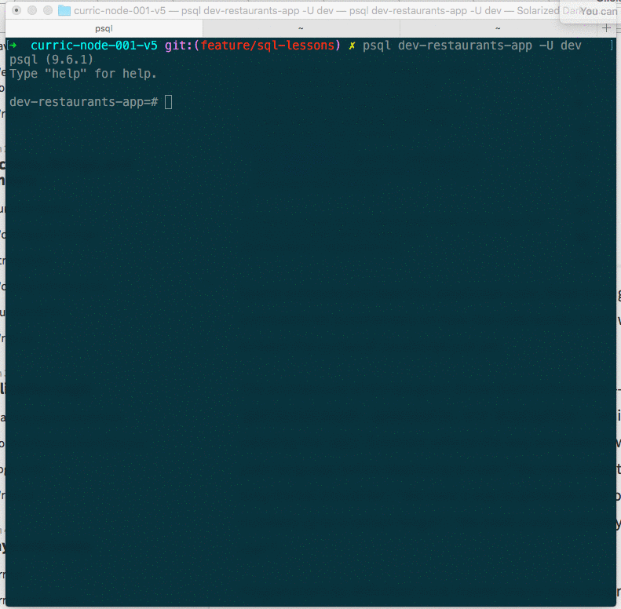
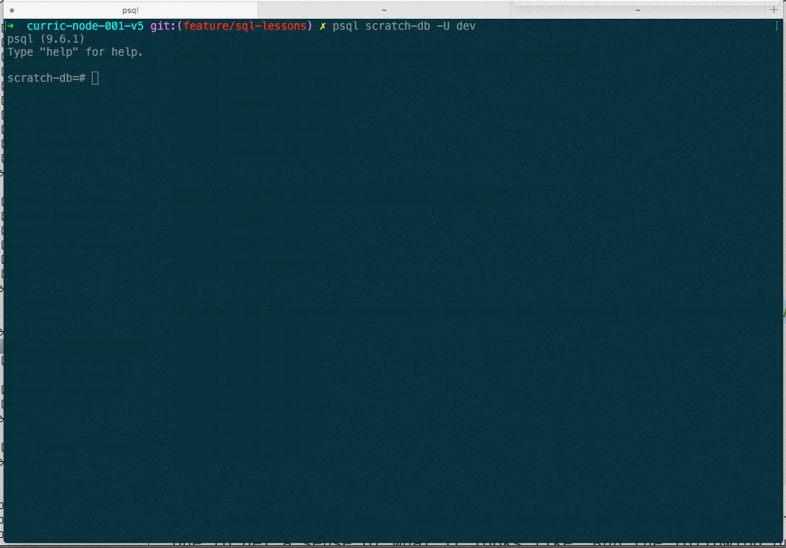

Imagine you are working on a project where you need to model customers, addresses, orders, and products.

* Customers might have >= 0 addresses and >= 0 orders (0 because a customer might be a prospect for whom we don't have an address or order yet).
* Addresses have exactly one customer. An address is owned by a customer, and there are no addresses without customers.
* Orders must have exactly one customer and are also owned by a customer. There are no orders without customers. While it's true that orders without products don't make a ton of sense, for now we'll say it's possible that an order can have no products (perhaps it's possible to start an order without putting any items in the cart, so to speak).
* Products are owned by an order.

How can we model this domain in a relational database? That's what we'll learn in this reading.

First, we'll examine how the *one-to-many/many-to-one* relationship between restaurants and grades is set up in our restaurants app database. The relationship between restaurants and grades is one-to-many: a restaurant can have many grades, but a grade only has one restaurant. From the standpoint of grades, that same relationship is many-to-one: many grades can point to a single restaurant.

We'll also learn how to handle *joins* in Postgres. A *join* is a SQL statement that relates one or more tables to one another. Finding the names of all the restaurants whose most recent grade is "C", for instance, would require joining the grades and restaurants tables.

Finally, we'll learn how to deal with *many-to-many relationships*. The relationship between orders and products is many-to-many in the scenario above: an order can have many products, and products can appear in many orders.

## Modeling many-to-one/one-to-many relationships

Make sure your Postgres server is running, and open the restaurants-app database in a Postgres shell.

Run the command `DELETE FROM restaurants WHERE id = '1000';`, and you should  get the following error:

```sql
ERROR:  update or delete on table "restaurants" violates foreign key constraint "grades_restaurant_id_fkey" on table "grades"
DETAIL:  Key (id)=(1000) is still referenced from table "grades".
```

Postgres is stopping us from deleting the restaurant because of a *foreign key constraint*. A *foreign key constraint* prevents us from destroying the *referential integrity* of a relational database. Let's see what that means.

Run `SELECT * FROM grades WHERE restaurant_id = 1000;`, and you'll see that there are four grade entries that reference the restaurant with id 1000. Each grade has a `restaurant_id` column whose value is the `id` of a row in the restaurants table.

If you run `\d grades`, you can see that there is a foreign key constraint called "grades_restaurant_id_fkey" that ties the `grades.restaurant_id` column to the `restaurants.id` column.

The principle of *referential integrity* holds that when you have a foreign key like `restaurant_id` that refers to a different row, you should never end up with a `restaurant_id` for a non-existent restaurant.

Here's how that behavior was achieved when originally setting up this database:

```sql
CREATE TABLE grades (
    id serial PRIMARY KEY,
    "date" timestamptz NOT NULL,
    grade text NOT NULL,
    score integer NOT NULL,
    restaurant_id integer REFERENCES restaurants
);
```

In our `CREATE TABLE` statement, we create a column for `restaurant_id` and use `REFERENCES` to establish a foreign key behavior.

If you query the `grades` table, you can see that there's a `restaurant_id` column that points to (that is, *references*) the restaurants table. You can see this by running `SELECT id, grade, restaurant_id FROM grades;`.



For foreign key constraints, we have a few options for specifying how to ensure referential integrity. First, we can go with the default behavior we have now: when someone tries to delete a restaurant referenced by one or more grades, we just stop the transaction from happening.

Another strategy is to use a *cascade*, which will cause the related entity to be dropped. When we initially set up the database, we could have gotten this behavior by using `ON DELETE CASCADE`:

```sql
CREATE TABLE grades (
    id serial PRIMARY KEY,
    "date" timestamptz NOT NULL,
    grade text NOT NULL,
    score integer NOT NULL,
    restaurant_id integer REFERENCES restaurants ON DELETE CASCADE
);
```

To try out this behavior, you can run the following command in the Postgres console to recreate the foreign key constraint with a cascade:

```sql
ALTER TABLE grades
    DROP CONSTRAINT grades_restaurant_id_fkey,
    ADD CONSTRAINT grades_restaurant_id_fkey
        FOREIGN KEY (restaurant_id)
        REFERENCES restaurants(id)
        ON DELETE CASCADE;
```

Afterwards, run the following sequence of commands:

```sql
SELECT count(*) from grades;
DELETE FROM restaurants WHERE id = 1000;
SELECT count(*) from grades;
```

Now when you delete a restaurant, any grades that reference that restaurant will also be deleted. The deletion of a restaurant *cascades* to its grades.

Another common approach is to set the foreign key value to `null`. When you delete a restaurant referenced by one or more grades, the grades will remain but their `restaurant_id` value will go to `null`.

To try out that behavior, we need to recreate the foreign key constraint:

```sql
ALTER TABLE grades
    DROP CONSTRAINT grades_restaurant_id_fkey,
    ADD CONSTRAINT grades_restaurant_id_fkey
        FOREIGN KEY (restaurant_id)
        REFERENCES restaurants(id)
        ON DELETE SET NULL;
```

Now run the following commands:

```sql
SELECT * FROM grades WHERE id = 15; -- it has restaurant_id of 10
DELETE FROM restaurants WHERE id = 10;
SELECT * FROM grades WHERE id = 15; -- restaurant_id is null
```

The right delete behavior for foreign key constraints depends on the specifics of the problem you're working on.

## Querying between tables with joins

To query between tables in SQL, we can use [joins](https://www.postgresql.org/docs/current/static/queries-table-expressions.html#QUERIES-JOIN). Let's say we wanted to restaurant data alongside each grade. Here's how we could do that:

```sql
SELECT grades.id as "grade id", grades.grade, grades.date as "grade date", restaurants.id as "restaurant id", restaurants.name, restaurants.borough
    FROM restaurants
    INNER JOIN grades
    ON grades.restaurant_id = restaurants.id
    WHERE BOROUGH = 'Staten Island'
    LIMIT 5;
```

In the `SELECT` part of this statement, we get access to both restaurant and grade columns. We also use [aliases](https://www.postgresql.org/docs/current/static/queries-table-expressions.html#QUERIES-TABLE-ALIASES) for the column names so the displayed column name for `grades.id` is "grade id, `grades.date` is "grade date", etc.

For the `FROM` part of the query, we use an *inner join* between the restaurants and grades table. With an inner join, you get back rows where the join condition is true. That means that we won't get back rows for restaurants without any grades or grades without restaurants.

The `ON` part of our query specifies the conditions of the join. Here, our only condition is that `grade.restaurant_id` has the same value as `restaurants.id`.

The `WHERE` part of the query limits the result of the join to only rows that have 'Staten Island' for the `restaurants.borough` column. Note that this `WHERE` happens *after* the initial join.

Here's how we can get back a list of restaurants that have gotten a "C" grade:

```sql
SELECT restaurants.id, restaurants.name, grades.date as "date of C grade"
    FROM restaurants
    INNER JOIN grades
    ON grades.restaurant_id = restaurants.id
    AND grades.grade = 'C'
    LIMIT 5;
```

Here, we have two criteria for the inner join. We want to join on restaurant id, but only in cases where `grades.grade` equals 'C'.

We can do things like count with inner joins just like with simple queries. Here's how to get the number of restaurants that have gotten a C grade:

```sql
SELECT count(*)
    FROM restaurants
    INNER JOIN grades
    ON grades.restaurant_id = restaurants.id
    AND grades.grade = 'C';
```

With an inner join, we only get back results for rows where the join condition is true. So with the query above, we won't get back rows for restaurants that have never gotten a 'C' grade.

To accomplish that, we need to use a *left join* (also know as a *left outer join*). A left join will produce a row for every row in the table to the left of the join statement, even if it has no corresponding data from the table being joined to.

Try running:

```sql
SELECT restaurants.id, restaurants.name, grades.date as "date of C grade"
    FROM restaurants
    LEFT JOIN grades
    ON grades.restaurant_id = restaurants.id
    AND grades.grade = 'C'
    ORDER BY grades.date ASC
    LIMIT 5;
```

Then:

```sql
SELECT restaurants.id, restaurants.name, grades.date as "date of C grade"
    FROM restaurants
    LEFT JOIN grades
    ON grades.restaurant_id = restaurants.id
    AND grades.grade = 'C'
    ORDER BY grades.date DESC
    LIMIT 5;
```

The only difference between the two queries is that the second one is sorted by descending order on grades.date. Null values come first when we sort that way, so that allows us to see some rows for restaurants that have never received a C.

There are also *right* and *full* joins.

```sql
SELECT
    FROM restaurants
    RIGHT JOIN grades
    ON grades.restaurant_id = restaurants.id
    WHERE BOROUGH = 'Staten Island';
```

A right join guarantees a row for every item in the entity to the right of the join statement (so we could use it to see all grades, even ones that don't have a restaurant).

A full join guarantees that you get a row for each row on both sides of the join. So you'd get rows for restaurants without grades, and rows for grades without restaurants.


## Many-to-many relationships

The final thing we'll learn about in this reading is modeling *many-to-many* relationships. At the beginning of this reading, we mentioned that the relationship between products and orders is many-to-many. An order can have multiple products, and products can appear in multiple orders.

Here's SQL to create the tables:

```sql
CREATE TABLE products (
    id SERIAL PRIMARY KEY,
    name TEXT NOT NULL,
    price NUMERIC NOT NULL DEFAULT 0
);

CREATE TYPE order_statuses AS ENUM (
    'open', 'in progress', 'shipped', 'returned');

CREATE TABLE ORDERS (
    id SERIAL PRIMARY KEY,
    status order_statuses NOT NULL DEFAULT 'open',
    created DATE NOT NULL DEFAULT CURRENT_DATE
);

CREATE TABLE order_products (
    order_id INT REFERENCES orders ON DELETE CASCADE,
    product_id INT REFERENCES products ON DELETE RESTRICT,
    quantity INT NOT NULL DEFAULT 1,
    PRIMARY KEY (order_id, product_id)
);

```

We've created tables for `products` and `orders`, and orders references the `order_statuses` enumerated type we also created. Finally, we create an association table that stores many-to-many relations between orders and products.

This table has foreign key columns for `order_id` and `product_id`. If an order gets deleted, we'll cascade to delete all `order_products` with that `order_id`. In contrast, we stop products from being deleted that are in `order_products`.

Each row in `order_products` gets a quantity column, and we specify that the `order_id` and `product_id` together form a primary key for the row. Since primary keys are unique, that means we can only have a single `order_products` entry for any given `order_id` / `products_id` combo.

Now, let's insert some data. Run the following SQL:

```sql
INSERT INTO products (name, price) VALUES
    ('shirt', 25),
    ('pants', 42),
    ('hat', 23),
    ('monocle', 50);

INSERT INTO orders (status) VALUES
    ('open'),
    ('open'),
    ('shipped');

INSERT INTO order_products (order_id, product_id, quantity) VALUES
    (1, 1, 2),
    (1, 3, 1),
    (1, 4, 1),
    (2, 4, 5),
    (3, 1, 1),
    (3, 3, 1);
```

In a moment we'll join rows from these three tables, but first let's query each one to get a sense of what it looks like. Run the following queries: `SELECT * FROM products;`, `SELECT * FROM orders`; `SELECT * FROM order_products`.



Each row in `order_products` has an `order_id` and `product_id` column, referencing the `orders` and `products` tables respectively.

To output product and order information for each row in `order_products`, we need to use two inner joins:

```sql
SELECT
    orders.id as "order id",
    orders.status,
    products.name as "product",
    products.price * order_products.quantity as "price",
    order_products.quantity

    FROM orders
    INNER JOIN order_products
    ON orders.id = order_products.order_id
    INNER JOIN products
    on products.id = order_products.product_id;
```

Here, we inner join orders to order_products to products, which gives us access to columns from all three tables where matches occur.

Note that we're also computing a price display value in the `SELECT` portion of our query. We multiply `products.price` by `order_products.quantity`.

Finally, check out the different foreign key constraint behaviors for orders and products. If you run `DELETE FROM products WHERE id = 1;`, you'll get an error, because we've restricted the database from deleting products that are referenced by an `order_products` row. In contrast, you can do `DELETE FROM orders = 1;`, but the referring rows in `order_products` will be deleted.

```sql
SELECT COUNT(*) FROM order_products where order_id = 1;
DELETE FROM orders WHERE id = 1;
SELECT COUNT(*) FROM order_products where order_id = 1;
```

