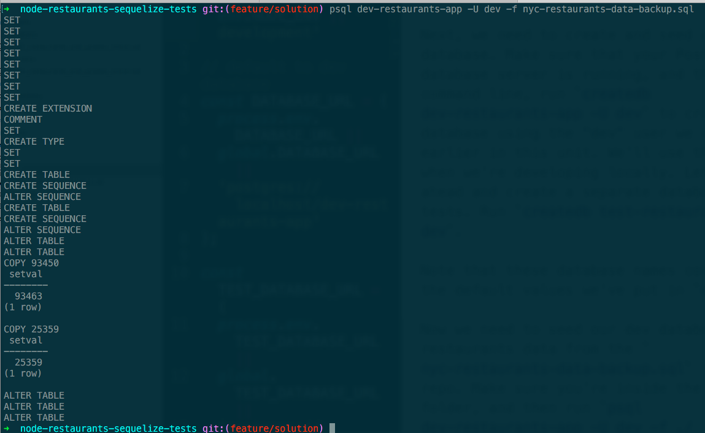

In this assignment, we'll continue our exploration of Sequelize. We'll revisit our New York City restaurant grades app from earlier in this course. We'll get more practice with Sequelize models, and we'll learn how to deal with relationships between models. We'll also learn how to handle SQL migrations for our models (that is, how to write the SQL scripts that initially set up our database), and how to write integration tests.

## Setting up the app

To start, clone [this GitHub repo](https://github.com/Thinkful-Ed/node-restaurants-sequelize-tests/tree/master). Now `cd` into the folder, and run `npm install`.

Next, we need to create and seed our database. Make sure that your Postgres database server is running. Then from the command line, run `createdb -U dev dev-restaurants-app` to create a new database using the "dev" user we created earlier in this unit. We'll use this database when we're developing locally. Let's also go ahead and create a separate database for tests. Run `createdb -U dev test-restaurants-app`.

Note that these database names correspond to the default values we've put in `config.js`.

Now we need to seed our dev database with restaurants data from the `nyc-restaurants-data-backup.sql` file in this repo. Make sure you're inside the project folder, and then run `psql -U dev -f ./nyc-restaurants-data-backup.sql dev-restaurants-app`. If all went well, you'll see an output that looks like this:



Start the app by running `npm start`.

## Try out the app

Use Postman to make some requests to the app. Try making GET requests to `localhost:8080/restaurants` to get the first 50 restaurants in the database (we've limited that endpoint to 50 so we don't return thousands of restaurants from this endpoint).

Try a GET request to `localhost:8080/restaurants/1` to get back a single restaurant. You should get back a JSON object that looks like this:

```json
{
      "id": 1,
      "name": "Dj Reynolds Pub And Restaurant",
      "cuisine": "Irish",
      "borough": "Manhattan",
      "address": {
        "number": "351",
        "street": "West   57 Street",
        "zip": "10019"
      },
      "mostRecentGrade": {
        "id": 1,
        "grade": "A",
        "inspectionDate": "2014-09-06T00:00:00.000Z",
        "score": 2
      }
    },
```

For each restaurant returned by the API, we get back its name, cuisine, address, and most recent grade.

To get back all the grades for a restaurant, we can make a request to `/restaurants/:id/grades`.

To create a new restaurant, make a POST request to `localhost:8080/restaurants`, setting the `Content-Type` header to `application/json` and the body to a JSON object that looks like this:

```json
{
    "name": "restaurant name",
    "borough": "Queens",
    "cuisine": "Italian",
    "addressBuildingNumber": "123",
    "addressStreet": "Big Street",
    "addressZipcode": "11427"
}
```

The DELETE and PUT endpoints work as you would expect from earlier assignments, so we won't go into detail here.

## Modeling relationships

In this app, we have two distinct models: one for restaurants and one for grades. Recall that in Mongoose we had a single model for restaurants, and grades were embedded in that model. Now that we're using a SQL-based ORM, we will create distinct models and tables for our data entities instead of embedding them.

We saw that when we GET a restaurant back from our API, we get back its most recent grade. When we POST a new restaurant, though, we do not include grade information. Let's have a look at how we've set up our models to achieve this.

Inside of `./models/restaurant.js`, we define a `Restaurant` model that looks like this:

```javascript
const Restaurant = sequelize.define('Restaurant', {
    name: {
      type: Sequelize.TEXT,
      allowNull: false
    },
    borough: Sequelize.ENUM('Brooklyn', 'Bronx', 'Manhattan', 'Queens', 'Staten Island'),
    cuisine: Sequelize.TEXT,
    addressStreet: {
      type: Sequelize.TEXT,
      field: 'address_street'
    },
    addressBuildingNumber: {
      type: Sequelize.TEXT,
      field: 'address_building_number'
    },
    addressZipcode: {
      type: Sequelize.TEXT,
      field: 'address_zipcode'
    }
  }, {
    tableName: 'restaurants',
    underscored: true,
    getterMethods: {
      mostRecentGrade: function() {
        let mostRecent = null;
        (this.getDataValue('grades') || []).forEach(grade => {
          if (!mostRecent || grade.inspectionDate > mostRecent.inspectionDate) {
            mostRecent = grade;
          }
        })
        return mostRecent;
      }
    },
    classMethods: {
      associate: function(models) {
        Restaurant.hasMany(
          models.Grade,
          {
            as: 'grades',
            foreignKey: { allowNull: false },
            onDelete: 'CASCADE'
          });
      }
    },
    instanceMethods: {
      apiRepr: function() {
        return {
          id: this.id,
          name: this.name,
          cuisine: this.cuisine,
          borough: this.borough,
          address: {
            number: this.addressBuildingNumber,
            street: this.addressStreet,
            zip: this.addressZipcode
          },
          mostRecentGrade: this.mostRecentGrade ? this.mostRecentGrade.apiRepr() : null
        }
      }
    }
  }
);
```

Here, the first argument to `sequelize.define` is our model name ('Restaurant'). The second argument is the attributes our model will have. These should look familiar from the previous assignment, with the exception of the `borough` property, which uses an `ENUM` data type.

In the third argument (the options object), there are three things to note. First, let's look at the `associate` class method. Here, we establish the relationship between restaurants and grades:

```javascript
Restaurant.hasMany(
    models.Grade,
    {
      as: 'grades',
      foreignKey: { allowNull: false },
      onDelete: 'CASCADE'
    });
}
```

Note that `associate` gets passed a `models` object. This is the `db` object that we create in `./models/index.js`. There, we iterate over all the models in `db` and call the `associate` method if it's been defined:

```javascript
Object.keys(db).forEach(function(modelName) {
  if (db[modelName].associate) {
    db[modelName].associate(db);
  }
});
```

In `Restaurant`'s `associate` method, we tell Sequelize that a restaurant [`hasMany`](http://docs.sequelizejs.com/en/v3/api/associations/#hasmanytarget-options) grades. We also pass in an options object. The `as: 'grades`, key/value pair says that the table name for the grades model is 'grades'. Since we're manually naming our tables, we need to include the table name using `as`. The `foreignKey: {allowNull: false}` key/value pair prevents grades being created without a related restaurant, because a restaurant grade without a restaurant doesn't make sense.

Finally, we define  `onDelete: 'CASCADE'` so that if a restaurant is deleted, so are its grades. Recall that in a Postgres database, the default 'ON DELETE' behavior for a relationship is to prevent a referenced row from being deleted.

In keeping with the pattern we learned about when working with Mongoose, we define an `apiRepr` instance method that we use to represent our model in our API layer:

```javascript
apiRepr: function() {
  return {
    id: this.id,
    name: this.name,
    cuisine: this.cuisine,
    borough: this.borough,
    address: {
      number: this.addressBuildingNumber,
      street: this.addressStreet,
      zip: this.addressZipcode
    },
    mostRecentGrade: this.mostRecentGrade ? this.mostRecentGrade.apiRepr() : null
  }
}
```

Here, we return a subset of the fields on our model. Recall that by default, Sequelize gives us `createdAt` and `updatedAt` attributes. While these may be valuable for administrative purposes, they're not relevant to clients making requests to the API, so we do not include these key/value pairs in our `apiRepr` method.

To get a value for the `mostRecentGrade` property, we use the `mostRecentGrade` getter method we've defined in our model. This is similar to Mongoose's virtual properties. Inside `mostRecentGrade`, we iterate over the restaurant's grades (if it has any) to find the one with the most recent inspection date. This method returns a grade or null.

```javascript
getterMethods: {
  mostRecentGrade: function() {
    let mostRecent = null;
    (this.grades || []).forEach(grade => {
      if (!mostRecent || grade.inspectionDate > mostRecent.inspectionDate) {
        mostRecent = grade;
      }
    })
    return mostRecent;
  }
},

```


Back in `apiRepr`, if `mostRecentGrade` returns a grade, we call that grade's `apiRepr` method. Otherwise, we set the value to `null`.

Now, let's have a look at our grade model:

```javascript
const Grade = sequelize.define('Grade', {
    grade: {
      type: Sequelize.STRING,
      allowNull: false
    },
    inspectionDate: {
      type: Sequelize.DATE,
      field: 'inspection_date',
      allowNull: false,
    },
    score: Sequelize.INTEGER
  }, {
    tableName: 'grades',
    underscored: true,
    classMethods: {
      associate: function(models) {
        Grade.belongsTo(
          models.Restaurant,
          {foreignKey: { allowNull: false }, onDelete: 'CASCADE' }
        );
      }
    },
    instanceMethods: {
      apiRepr: function() {
        return {
          id: this.id,
          grade: this.grade,
          inspectionDate: this.inspectionDate,
          score: this.score
        }
      }
    }
  }
);

```

In `Grade`'s `associate` method, we define the flip side of the has-many relationship we defined in `Restaurant`. We say that each grade [`belongsTo`](http://docs.sequelizejs.com/en/latest/docs/associations/#belongsto) a restaurant. Note that we include the same values for `foreignKey` and `onDelete` as we did on `Restaurant`. Ideally, we'd only need set this up on one side of the relationship, but this is yet another Sequelize quirk.

This should give you an initial sense of how relationships work in Sequelize. Spend a few minutes looking over what the [official docs](http://docs.sequelizejs.com/en/v3/docs/associations/) have to say about this. You'll get to practice this later in this lesson when you create Sequelize models for a blogging app.

### Routes with relationships

We're not going to walk through each route in our app in detail, but we do want to call attention to how we deal with relationships. Inside of `./routes/restaurant.js` in the `GET /` route, we have:

```javascript
router.get('/', (req, res) => Restaurant.findAll(
  {
    limit: 50,
    include: [{
        model: Grade,
        as: 'grades'
    }]
  })
  .then(restaurants => res.json({
    restaurants: restaurants.map(rest => rest.apiRepr())
  }))
);

```

When a user makes a request to `/restaurants/`, we get retrieve up to 50 restaurants (`limit: 50`). The `include` key/value pair tells Sequelize that when it retrieves a restaurant it should include that restaurant's grades, if any. This is known as [eager loading](http://docs.sequelizejs.com/en/latest/docs/models-usage/#eager-loading).

If we were to omit this property, when Sequelize retrieves restaurants from the database, it would only get back values for the columns defined in the restaurants table, which do not include any info about grades. `include` causes Sequelize to create a query that returns the restaurant and its grades.

If you make a GET request to `localhost:8080/restaurants/1`, in the server logs you can see the SQL query that Sequelize makes to the database:

```
Executing (default): SELECT "Restaurant"."id", "Restaurant"."name", "Restaurant"."borough", "Restaurant"."cuisine", "Restaurant"."address_street" AS "addressStreet", "Restaurant"."address_building_number" AS "addressBuildingNumber", "Restaurant"."address_zipcode" AS "addressZipcode", "Restaurant"."created_at", "Restaurant"."updated_at", "grades"."id" AS "grades.id", "grades"."grade" AS "grades.grade", "grades"."inspection_date" AS "grades.inspectionDate", "grades"."score" AS "grades.score", "grades"."created_at" AS "grades.created_at", "grades"."updated_at" AS "grades.updated_at", "grades"."restaurant_id" AS "grades.restaurant_id" FROM "restaurants" AS "Restaurant" LEFT OUTER JOIN "grades" AS "grades" ON "Restaurant"."id" = "grades"."restaurant_id" WHERE "Restaurant"."id" = '1';
```

As you can see, Sequelize translates our `include` into a `LEFT OUTER JOIN` of the restaurants and grades table.

Because we're manually setting table names, inside our `include` we have `as: 'grades'`. Ideally, we'd only define this mapping once, on the model definition, but this is another of Sequelize's quirks.

Eager loading each restaurant's grades is what allows our call to `restaurant.apiRepr()` to work. As we saw, the restaurant's `apiRepr` method iterates over `restaurant.grades`. Without eager loading, this method would fail.

We use the same `include` configuration in our routes for `/restaurants/` and `/restaurants/:id/grades`. For any restaurant route that also needs access to grades data, we use `include`.

### Integration testing with Sequelize

The integration tests we've written for this app closely resemble the ones from [the Mongoose version of this app](https://github.com/Thinkful-Ed/node-restaurants-app-mongoose/tree/feature/with-tests). Our strategy remains the same: before each test, get the database in a known state, interact with the API layer, make assertions about the response, and optionally make assertions about the state of the database.

The key difference here lies in the test setup. Inside `./test/helper.js`, we define `before` and `after` routines that will run once and only once before and after our entire suite of tests runs.

```javascript
before(function() {
  return sequelize
    .sync({force: true})
    .then(() => runServer(PORT));
});
```

In `before` routine, we call [`sequelize.sync`](http://docs.sequelizejs.com/en/v3/docs/schema/#syncing). This method causes Sequelize to look at all the models that have been loaded and then send commands to the test database to create the tables required by our models. The `force: true` option causes any existing tables to be dropped and then created new. `sequelize.sync` returns a promise, and in our chained `.then` we call `runServer` to start our server.

One note of caution: in a moment we'll learn how we to use SQL scripts to handle migrations in our Sequelize apps. While this is the approach we recommend, it would also be possible to call `sequelize.sync` somewhere in our `runServer` function, omitting the `force: true` option. This would cause Sequelize to create any required tables each time the app starts (and excluding `force: true` would ensure that it doesn't drop the current tables, so we wouldn't lose our data). While this approach may be tempting because it would allow us to avoid manually writing SQL scripts, we find it problematic for two reasons. First, it's potentially dangerous to call `sequelize.sync` in production code because you could inadvertently wipe out your database. Second, we believe it's better to manually create migration scripts so you have full control over and knowledge of the database schema.

Our `after` routine is responsible for calling `closeServer`, which in turn calls `sequelize.close` to disconnect from the database:

```javascript
after(function() {
    return closeServer();
});
```

Having a look at `./test/test-restaurants-endpoint.js`, there are a few things to note. The first few methods in this module are for generating test data and should look familiar from the Mongoose version of this app.

At the top of `describe('Restaurants API resource'...` we define a `beforeEach` routine that looks like this:

```javascript
beforeEach(function() {
    return Restaurant
      .truncate({cascade: true})
      .then(() => seedRestaurantData());
});

```

This says that before each test in this suite, we should drop all rows from the restaurants table ([`.truncate`](http://docs.sequelizejs.com/en/latest/api/model/#truncateoptions-promise), cascading to delete any related grades. When this promise returns, we call our `seedRestaurantData` function. Overall, this `beforeEach` routine ensures that we drop all data from our tables (without destroying the tables themselves) then seed the database before each test runs.

We're not going to walk through each test because the strategy here is the same as the one we covered in depth when we learned about integration testing with Mongoose. However, you should take a few minutes to read through `./test/test-restaurants-endpoint.js`.

## Using SQL scripts for migrations

The final thing we'll cover is our strategy for migrating our models when working with Sequelize. Here, "migrating" means setting up tables in our database that correspond to our model definitions.

As we said in the previous section, one way to do this would be to call `sequelize.sync` somewhere in our application code. However, as we said, this is a risky approach. Also, it means we aren't forced to explicitly understand our database schema.

Another option would be to use the [Sequelize CLI](https://github.com/sequelize/cli) package to manage our migrations from the command line. Sequelize CLI provides command line tools that can be used to set up models and run migrations. While this sounds promising in theory, in practice we find this approach error-prone and more difficult than just writing SQL scripts.

At the beginning of this assignment, we imported the `nyc-restaurants-data-backup.sql` script to recreate an existing database. That script set up our tables and inserted thousands of rows.

Most of the time when you're creating an app from scratch though, you'll need to write a migration script that's responsible only for creating the tables your app requires. We've included such a migration script in this repo.

Inside `./migrations/0001_restaurants_and_grades_initial.sql`, we have:

```sql
BEGIN;

CREATE TYPE boroughs AS ENUM (
    'Bronx', 'Brooklyln', 'Manhattan', 'Queens', 'Staten Island', 'Missing');

CREATE TABLE restaurants (
    id SERIAL PRIMARY KEY,
    created_at TIMESTAMP NOT NULL,
    updated_at TIMESTAMP NOT NULL,
    name TEXT NOT NULL,
    cuisine TEXT,
    borough boroughs,
    address_building_number TEXT,
    address_street TEXT,
    address_zipcode TEXT
);

CREATE TABLE grades (
    id SERIAL PRIMARY KEY,
    created_at TIMESTAMP NOT NULL,
    updated_at TIMESTAMP NOT NULL,
    inspection_date TIMESTAMP NOT NULL,
    restaurant_id INTEGER REFERENCES restaurants ON DELETE CASCADE NOT NULL,
    grade TEXT NOT NULL,
    score INTEGER NOT NULL
);

COMMIT;

```

This script first creates an enumerable type for boroughs, then the restaurants table, and finally the grades table. The `BEFORE;` and `AFTER;` commands ensure that these commands succeed or fail together. So if creating the restaurants table succeeds but the grades table fails, neither table will be created.

Note that we use snake case for all column names in our tables. The values we indicate here correspond to the `field` values we set in the respective attribute definitions in our Sequelize models.

The `NOT NULL` constraints in both tables correspond to `allowNull: false` entries in our models.

We create columns for `created_at` and `updated_at` on both tables, because Sequelize automatically adds these attributes to all models. Because we've set the `underscored: true` attribute in our model definitions, we use `created_at`/`updated_at` here, instead of `"createdAt"` / `"updatedAt"`.

In our grades table, we set define the relationship between restaurants and grades. The `ON DELETE CASCADE NOT NULL` setting corresponds to the `{foreignKey: { allowNull: false }, onDelete: 'CASCADE' }` settings on our models.

If you were creating this app from scratch and without the backup data we used, you'd need to run this migration before starting the app. Otherwise, any query Sequelize would make to the database would fail because no tables would be created.

Later in this lesson when we discuss continuous integration with Sequelize, we'll learn how and when to handle migrations in production.

